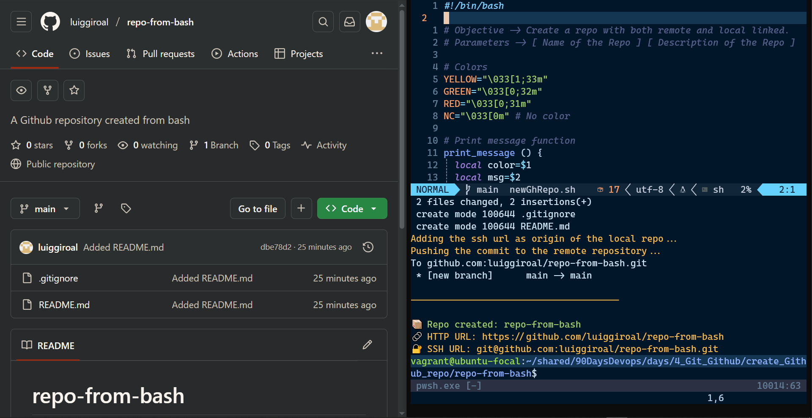

# 📦 Repositorio desde Bash

**[English Version](./README.md)**

<hr>

****

## 📋 Descripción

Este proyecto automatiza el proceso de creación de un repositorio en GitHub e inicialización de un repositorio Git local mediante un script en Bash. Incluye pasos para crear el repositorio remoto, inicializar una carpeta local, configurar la rama `main`, crear un `README.md` y hacer push del primer commit a GitHub usando HTTPS o SSH.

## 🚀 Características

- Crear repositorio en GitHub usando la CLI (`gh`)
- Inicializar y configurar un repositorio Git local
- Crear y hacer commit de un archivo `README.md`
- Soporte para URLs remotas por HTTPS o SSH
- Envío automático (`push`) a la rama `main`

---

## 🛠 Requisitos

- [Git](https://git-scm.com/)
- [GitHub CLI (`gh`)](https://cli.github.com/)
- Intérprete de comandos Bash

---

## 🧾 Uso

```bash
./newGhRepo.sh <nombre-del-repositorio> [descripción-opcional]
```

Ejemplo:

```bash
./newGhRepo.sh mi-nuevo-repo "Este es mi nuevo proyecto en GitHub"
```

Se te pedirá elegir entre `ssh` o `https` como método para configurar la URL remota.

---

## 📄 Salida

El script guarda el resultado del proceso en `output.log` y muestra información clave como el nombre del repositorio y las URLs utilizadas.

---

## 📁 Archivos Generados

- `README.md` con el nombre del repositorio como título
- Carpeta `.git/` con la configuración del repositorio
- Archivo `output.log` con el registro del proceso

---

## ✍️ Autor

**Luiggi Rodriguez**  
[GitHub](https://github.com/luiggiroal)
