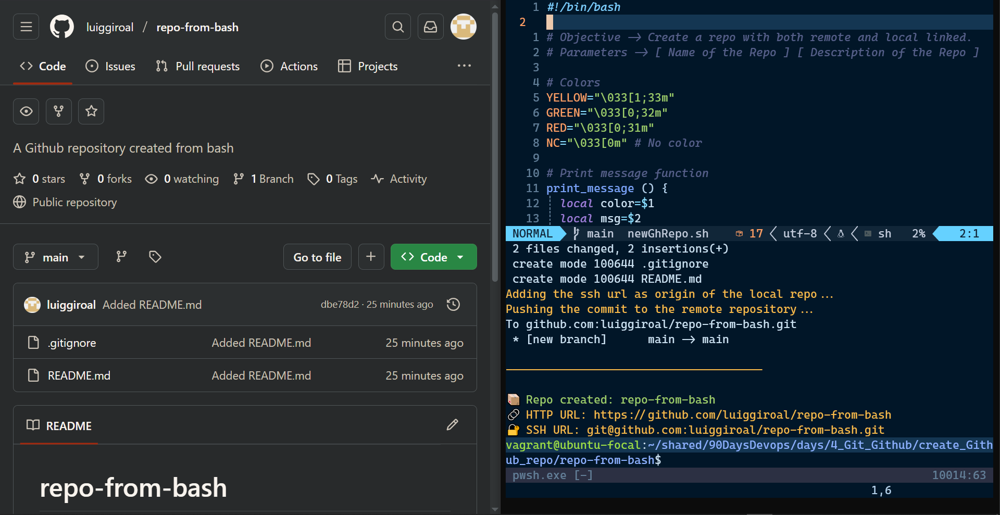

# 📦 Repo from Bash

**[Versión en Español](./README.es.md)**

<hr>

****

## 📋 Description

This project automates the process of creating a GitHub repository and initializing a local Git repository using a Bash script. It includes steps to create the remote repo, initialize a local folder, set up the `main` branch, create a `README.md`, and push the first commit to GitHub using either HTTPS or SSH.

## 🚀 Features

- Create GitHub repo via CLI (`gh`)
- Initialize and configure a local Git repo
- Create and commit a `README.md`
- Support for HTTPS or SSH remotes
- Auto-push to the `main` branch

---

## 🛠 Requirements

- [Git](https://git-scm.com/)
- [GitHub CLI (`gh`)](https://cli.github.com/)
- Bash shell

---

## 🧾 Usage

```bash
./newGhRepo.sh <repo-name> [optional-description]
```

Example:

```bash
./newGhRepo.sh my-new-repo "This is my new GitHub project"
```

You will be prompted to select between `ssh` or `https` as the remote URL method.

---

## 📄 Output

The script logs its output in `output.log` and prints key information, including the repo name and GitHub URLs.

---

## 📁 Generated Files

- `README.md` with the repo title
- `.git/` folder and Git configuration
- `output.log` with process logs

---

## ✍️ Author

**Luiggi Rodriguez**  
[GitHub](https://github.com/luiggiroal)
