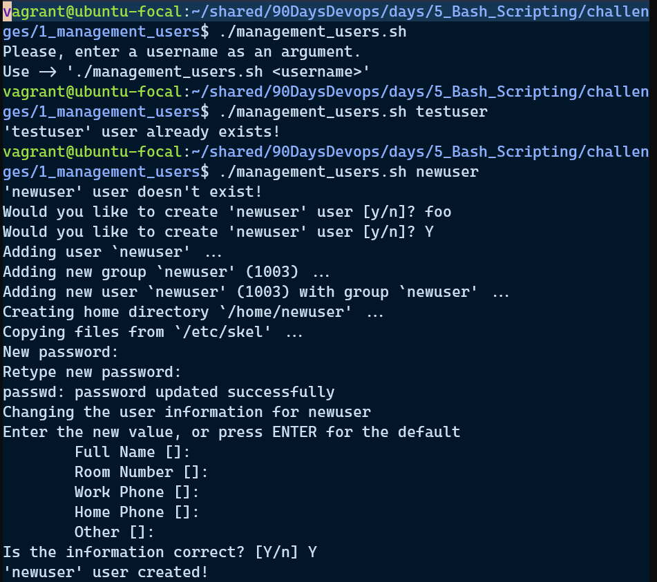

# Día 5: Bash Scripting

**[English Version](./README.md)**

Este directorio se centra en los fundamentos de Bash scripting como parte del reto 90 Days of DevOps. Contiene apuntes prácticos, desafíos, ejercicios y scripts para un aprendizaje práctico.

## Estructura

- [`observations.txt`](./observations.txt):  
  Apuntes prácticos y soluciones para problemas comunes en Bash scripting, incluyendo:
  - Manejo de entornos no interactivos (como cron jobs).
  - Manejo de permisos de archivos en Vagrant y carpetas sincronizadas.
  - Diferencias entre `source script.sh` y ejecutar `./script.sh`.
  - Por qué usar `$HOME` en lugar de `~` en scripts.
  - Comportamiento de los subshells en Bash.
  - Uso de npm y node con Vagrant y manejo de problemas con symlinks.
  - Buenas prácticas generales y consejos de solución de problemas en Bash.

- **[`challenges/`](./challenges):**  
  **Este directorio contiene desafíos prácticos de Bash scripting y DevOps:**

  ### 1. `1_management_users`

  **Objetivo:**  
  Escribe scripts Bash para automatizar tareas comunes de gestión de usuarios y grupos en Linux.  
  **Tareas incluyen:**
  - Crear y eliminar usuarios y grupos
  - Asignar usuarios a grupos
  - Configurar contraseñas y shells predeterminados
  - Aplicar políticas de contraseñas
  - Listar usuarios, grupos y sus membresías

  **Meta:**  
  Familiarízate con comandos de administración de sistemas, automatización con scripts y gestión de permisos.

## ****

---

### 2. `2_deploy_Book_Library`

**Objetivo:**  
 Automatiza el despliegue de una aplicación web "Book Library" usando Bash.  
 **Tareas incluyen:**

- Instalar dependencias necesarias (por ejemplo, Node.js, Python o paquetes requeridos)
- Clonar el repositorio de la aplicación
- Configurar variables de entorno y archivos de configuración
- Ejecutar migraciones de base de datos o scripts de inicialización
- Iniciar la aplicación y verificar que sea accesible

**Meta:**  
 Practica la automatización del despliegue de aplicaciones, comprende las dependencias de los servicios y asegura la reproducibilidad de los pasos de despliegue.

## ****

---

### 3. `3_deploy_app_with_PM2`

**Objetivo:**  
 Despliega una aplicación web utilizando [PM2](https://pm2.keymetrics.io/), un gestor de procesos para aplicaciones Node.js.  
 **Tareas incluyen:**

- Instalar PM2 globalmente en el servidor
- Usar PM2 para iniciar, detener y reiniciar la aplicación
- Configurar PM2 para que la app siga ejecutándose tras reinicios del servidor
- Monitorear logs y el estado de la aplicación con comandos de PM2
- Guardar y restaurar listas de procesos

**Meta:**  
 Aprende a usar PM2 para la gestión robusta de apps Node.js en producción y automatiza el flujo de trabajo con scripts Bash.

## ****

---

- [`exercises/`](./exercises):  
  Ejercicios prácticos para poner en práctica conceptos de Bash scripting.

- **[`opt_tasks/`](./opt_tasks):**  
  **Este directorio provee tareas opcionales para profundizar y practicar más conceptos avanzados de Bash scripting y DevOps. Los ejercicios están diseñados para retarte y exponerte a escenarios más complejos.**

  ### Ejemplos de tareas
  - **Rotación automática de logs:**  
    Escribe un script que rote, comprima y archive archivos de log más antiguos que un número específico de días.

  - **Monitoreo de recursos del sistema:**  
    Crea un script Bash que monitoree el uso de CPU, memoria y disco, enviando alertas si se superan ciertos umbrales.
  - **Backups programados con verificación:**  
    Desarrolla un script de backup que archive archivos o carpetas en un horario y además verifique la integridad del backup.

  - **Integración con herramientas externas:**  
    Escribe un script que interactúe con APIs externas o herramientas de línea de comandos (ej: enviar notificaciones a Slack o Discord cuando un trabajo termina).

  - **Benchmarking de rendimiento:**  
    Automatiza pruebas de rendimiento sobre un servicio o aplicación, recolectando y reportando los resultados.

  **Meta:**  
  Utiliza estas tareas para llevar tus scripts al siguiente nivel, construir un portafolio de utilidades útiles y prepararte para automatizaciones y monitoreos complejos en la vida real.

- **[`scripts/`](./scripts):**  
  **Una colección de scripts Bash de ejemplo que muestran diversas técnicas, soluciones y buenas prácticas. Cada script está bien comentado y sirve como referencia o plantilla para tu propia automatización.**

  ### Descripción de los scripts
  - **`disk_use_alert.sh`**  
    Monitorea el uso de disco en sistemas de archivos especificados y envía una alerta si el uso supera un umbral definido.  
    _Uso:_ Monitoreo proactivo para prevenir interrupciones por falta de espacio en disco.

  - **`health_system_monitor.sh`**  
    Realiza chequeos completos de recursos del sistema (CPU, memoria, disco) y escribe los resultados en `health_system.log`.  
    _Uso:_ Monitoreo continuo y análisis de tendencias de la salud del sistema.

  - **`health_system.log`**  
    Archivo de log generado por `health_system_monitor.sh` con registros con marcas de tiempo de los chequeos del sistema.  
    _Uso:_ Registro histórico para auditoría y planeación de capacidad.

  - **`verify_reboot_service.sh`**  
    Verifica si un servicio específico ha reiniciado correctamente tras un reboot del sistema.  
    _Uso:_ Asegura que servicios críticos estén activos luego de reinicios, importante para ambientes de producción.

  **Meta:**  
  Explora estos scripts para entender patrones prácticos en Bash y adáptalos o extiéndelos según tus necesidades DevOps.

## Para empezar

1. Comienza leyendo `observations.txt` para consejos prácticos y errores comunes en Bash scripting.
2. Realiza los ejercicios y desafíos para aplicar tus conocimientos.
3. Explora las tareas opcionales para práctica avanzada.
4. Revisa y ejecuta los scripts de ejemplo en el directorio `scripts/`.

## Consejos

- Usa siempre `$HOME` en vez de `~` en scripts para mayor portabilidad.
- Entiende cuándo usar `source` y cuándo ejecutar un script en Bash.
- Para cron jobs, evita prompts interactivos y asegúrate que los scripts sean ejecutables.
- Pon atención a los permisos de archivos, especialmente en carpetas sincronizadas o compartidas.
