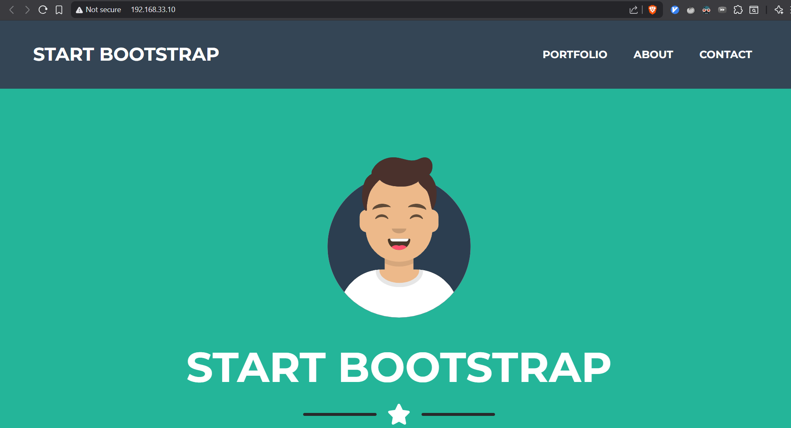
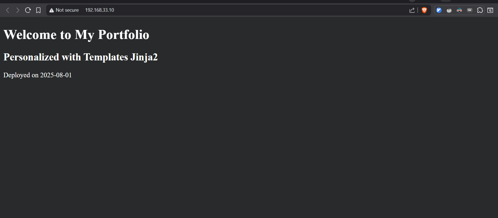
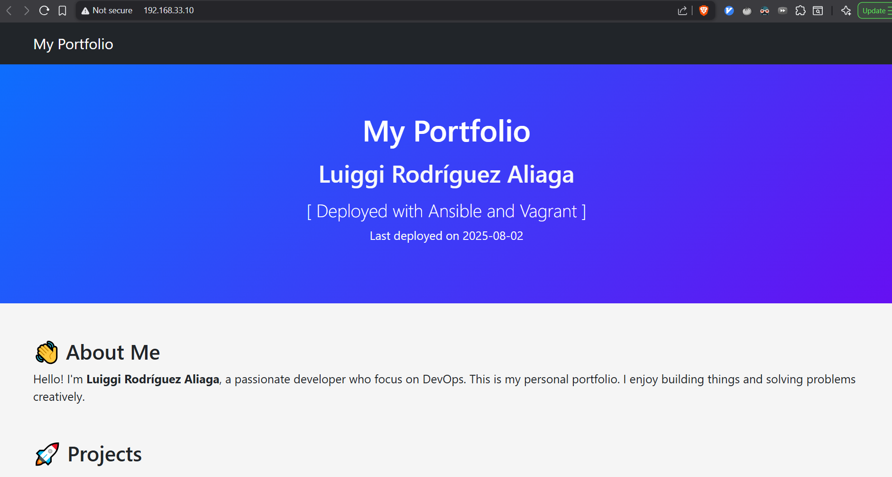

# Día 6: Automatización con Ansible

**[English Version](./README.md)**

Este directorio contiene los materiales para el Día 6 del curso 90DaysDevops, enfocado en Ansible. Aquí encontrarás ejercicios prácticos y desafíos para aprender y aplicar Ansible en el aprovisionamiento de servidores y el despliegue de aplicaciones.

## Estructura del Directorio

-   `challenges/`: Contiene desafíos prácticos para desplegar aplicaciones web utilizando diferentes técnicas de Ansible.
-   `exercises/`: Incluye playbooks introductorios para la configuración básica de servidores.
-   `opt_tasks/`: Proporciona tareas opcionales adicionales para practicar más.
-   `observations.txt`: Contiene notas clave y conclusiones sobre el uso de Ansible con Vagrant.

---

## 🚀 Desafíos

Esta sección contiene el trabajo práctico principal para aprender Ansible. Cada desafío es un proyecto autónomo dentro de su propio directorio.

### Desafío 1: Despliegue de Portafolio de Freelancer (`1_freelancer_deploy/`)

Este desafío se centra en desplegar un sitio web de portafolio estático desde un repositorio de GitHub utilizando un único playbook de Ansible.

**Objetivo:**
Automatizar el despliegue de un servidor web (Nginx) y un sitio web estático utilizando Vagrant y el provisionador `ansible_local` de Ansible.

**Componentes Clave:**

-   `Vagrantfile`: Configura la máquina virtual y activa el provisionador `ansible_local` para ejecutar el playbook dentro de la VM invitada.
-   `playbook.yml`: El playbook principal que realiza las siguientes tareas:
    -   Instala Nginx, unzip y wget.
    -   Descarga y descomprime una plantilla de sitio web.
    -   Mueve el contenido del sitio web a la raíz web.
    -   Personaliza el `index.html` utilizando una plantilla Jinja2.
    -   Configura un bloque de servidor Nginx para el sitio.
-   `vars/vars.yml`: Externaliza variables como la URL del repositorio y el título del sitio.
-   `templates/index.html.j2`: Una plantilla Jinja2 para crear una página de inicio personalizada.
-   `test_nginx_webpage.yml`: Un playbook para verificar que Nginx se está ejecutando y sirviendo contenido correctamente.

## ****

## ****

### Desafío 2: Despliegue de Aplicación Web con Roles (`2_deploy_app/`)

Este desafío introduce un enfoque más estructurado y escalable para la automatización al refactorizar la lógica de despliegue en Roles de Ansible reutilizables.

**Objetivo:**
Desplegar un entorno de servidor web organizando las tareas en roles distintos para `nginx`, `devops` (gestión de usuarios) y `firewall`.

**Componentes Clave:**

-   `Vagrantfile`: Aprovisiona la VM y especifica el playbook, la ruta del inventario y limita la ejecución al grupo `web`.
-   `playbook.yml`: Un playbook simple que orquesta la ejecución de los roles definidos.
-   `inventories/`: Contiene el archivo de inventario (`hosts.ini`) que define los hosts de destino.
-   **`roles/`**:
    -   **`nginx`**:
        -   Instala y configura Nginx.
        -   Despliega una página `index.html` personalizada y con estilo desde una plantilla Jinja2.
        -   Gestiona la configuración del sitio de Nginx.
    -   **`devops`**:
        -   Crea un usuario `devops` con privilegios `sudo`.
        -   Configura la autenticación basada en clave SSH para el nuevo usuario.
    -   **`firewall`**:
        -   Configura UFW (Uncomplicated Firewall) para permitir el tráfico en los puertos necesarios (SSH, HTTP, HTTPS).

Esta estructura promueve la reutilización y hace que la automatización sea más fácil de leer, gestionar y extender.

## ****

---

## Resumen de Observaciones

Aquí están las conclusiones clave del archivo `observations.txt` sobre Ansible y Vagrant:

-   **Provisionador `ansible_local`**: Úsalo en tu `Vagrantfile` para ejecutar Ansible desde dentro de la VM invitada. Es ideal para hosts de Windows o para crear entornos autónomos y portátiles. Vagrant instalará Ansible automáticamente en el invitado si es necesario.

-   **Configuración del `Vagrantfile`**:
    -   Al definir el nombre de host de una VM, evita usar guiones bajos (por ejemplo, usa `ansible-server` en lugar de `ansible_server`).
    -   `ansible.inventory_path` apunta a tu archivo de inventario en la máquina anfitriona.
    -   `ansible.limit` restringe la ejecución del playbook a hosts o grupos específicos (por ejemplo, `"web"`).

-   **Estructura de Roles de Ansible**: Un rol estándar incluye `tasks/main.yml`, `vars/main.yml` y un directorio de `templates`. Este enfoque modular ayuda a organizar y reutilizar la lógica de automatización para diferentes componentes como `nginx`, `firewall` o la gestión de usuarios.

---

## Cómo Ejecutar los Desafíos

1.  Navega al directorio del desafío deseado (por ejemplo, `cd challenges/1_freelancer_deploy`).
2.  Ejecuta `vagrant up` para crear la máquina virtual y ejecutar el provisionador de Ansible.
3.  Una vez que el aprovisionamiento esté completo, puedes acceder al sitio desplegado o conectarte por SSH a la máquina (`vagrant ssh`) para verificar la configuración.
4.  Ejecuta `vagrant destroy -f` para limpiar el entorno.
