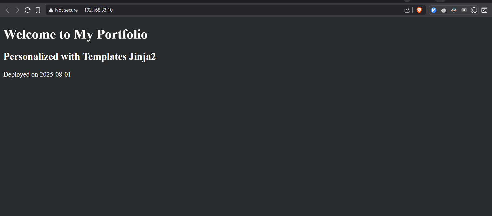

# Day 6: Ansible Automation

**[Versión en Español](./README.es.md)**

This directory contains materials for Day 6 of the 90DaysDevops course, focusing on Ansible. Here you'll find practical exercises and challenges to learn and apply Ansible for server provisioning and application deployment.

## Directory Structure

- `challenges/`: Contains hands-on challenges to deploy web applications using different Ansible techniques.
- `exercises/`: Includes introductory playbooks for basic server configuration.
- `opt_tasks/`: Provides additional, optional tasks for further practice.
- `observations.txt`: Contains key notes and takeaways about using Ansible with Vagrant.

---

## 🚀 Challenges

This section contains the core practical work for learning Ansible. Each challenge is a self-contained project within its own directory.

### Challenge 1: Freelancer Portfolio Deployment (`1_freelancer_deploy/`)

This challenge focuses on deploying a static portfolio website from a GitHub repository using a single Ansible playbook.

**Objective:**
Automate the deployment of a web server (Nginx) and a static website using Vagrant and Ansible's `ansible_local` provisioner.

**Key Components:**

- `Vagrantfile`: Configures the virtual machine and triggers the `ansible_local` provisioner to run the playbook inside the guest VM.
- `playbook.yml`: The main playbook that performs the following tasks:
  - Installs Nginx, unzip, and wget.
  - Downloads and unzips a website template.
  - Moves the website content to the webroot.
  - Personalizes the `index.html` using a Jinja2 template.
  - Configures an Nginx server block for the site.
- `vars/vars.yml`: Externalizes variables like the repository URL and site title.
- `templates/index.html.j2`: A Jinja2 template to create a customized landing page.
- `test_nginx_webpage.yml`: A playbook to verify that Nginx is running and serving content correctly.

## ****

## ****

### Challenge 2: Web Application Deployment with Roles (`2_deploy_app/`)

This challenge introduces a more structured and scalable approach to automation by refactoring the deployment logic into reusable Ansible Roles.

**Objective:**
Deploy a web server environment by organizing tasks into distinct roles for `nginx`, `devops` (user management), and `firewall`.

**Key Components:**

- `Vagrantfile`: Provisions the VM and specifies the playbook, inventory path, and limits the execution to the `web` group.
- `playbook.yml`: A simple playbook that orchestrates the execution of the defined roles.
- `inventories/`: Contains the inventory file (`hosts.ini`) that defines the target hosts.
- **`roles/`**:
  - **`nginx`**:
    - Installs and configures Nginx.
    - Deploys a custom, styled `index.html` page from a Jinja2 template.
    - Manages the Nginx site configuration.
  - **`devops`**:
    - Creates a `devops` user with `sudo` privileges.
    - Sets up SSH key-based authentication for the new user.
  - **`firewall`**:
    - Configures UFW (Uncomplicated Firewall) to allow traffic on necessary ports (SSH, HTTP, HTTPS).

This structure promotes reusability and makes the automation easier to read, manage, and extend.

## ****

---

## Observations

Here are the key takeaways from the `observations.txt` file regarding Ansible and Vagrant:

- **`ansible_local` Provisioner**: Use this in your `Vagrantfile` to run Ansible from within the guest VM. It's ideal for Windows hosts or for creating self-contained, portable environments. Vagrant will automatically install Ansible on the guest if needed.

- **Vagrantfile Configuration**:
  - When defining a VM's hostname, avoid using underscores (e.g., use `ansible-server` instead of `ansible_server`).
  - `ansible.inventory_path` points to your inventory file on the host machine.
  - `ansible.limit` restricts the playbook run to specific hosts or groups (e.g., `"web"`).

- **Ansible Role Structure**: A standard role includes `tasks/main.yml`, `vars/main.yml`, and a `templates` directory. This modular approach helps organize and reuse automation logic for different components like `nginx`, `firewall`, or user management.

---

## How to Run the Challenges

1.  Navigate to the desired challenge directory (e.g., `cd challenges/1_freelancer_deploy`).
2.  Run `vagrant up` to create the virtual machine and run the Ansible provisioner.
3.  Once provisioning is complete, you can access the deployed site or SSH into the machine (`vagrant ssh`) to verify the setup.
4.  Run `vagrant destroy -f` to clean up the environment.
